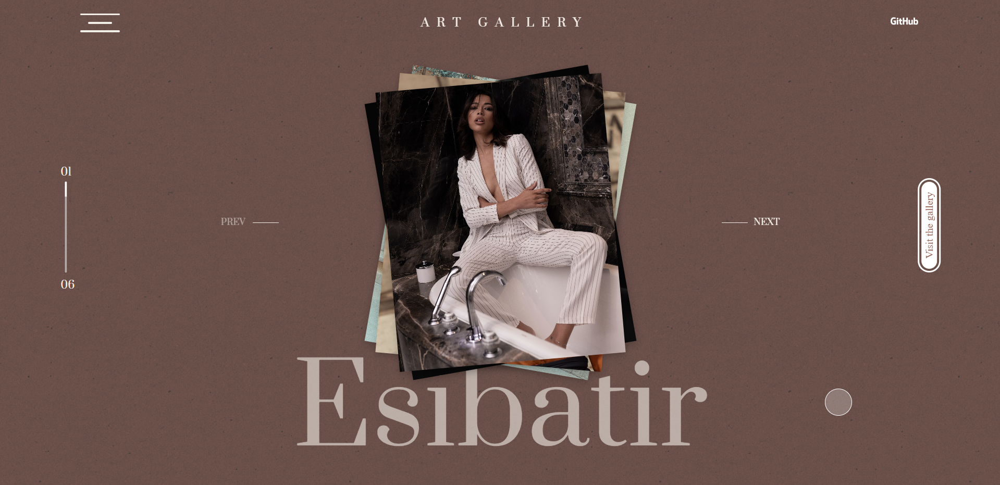

    <h4><b>Art gallery</b></h4>
    <h4>
        <a href="#about">About the project</a>
        •
        <a href="#links">Links</a>
        •
        <a href="#built-with">Built with</a>
        •
        <a href="#architecture">Project folder description</a>
        •
        <a href="#contact">Credits</a>
    </h4>

 
    

## Table of contents

- [Table of contents](#table-of-contents)
- [About the project](#about-the-project)
- [Links](#links)
- [Built with](#built-with)
- [Project folder description (src)](#project-folder-description-src)
- [Credits](#credits)

## About the project

 
  I came up with this project during the building process of a galery website for a client. We were thinking about how to add dynamic visuals into it, so I thought about creating a side project to test creative animations I could add to it.

## Links

The project is based on this prototype:
✐ **Dribbble**: https://www.figma.com/file/8WgQuNX3rIicR8ZLqHVYod/Soccer?type=design&node-id=0%3A1&t=3eFeRSvXqnsVCsQD-1

## Built with

Frontend
* 
* 

## Project folder description (src)

* public: images and data
* src: assets, components, constants, context, hooks and entry points
* types: data types

## Credits

Diane M.

